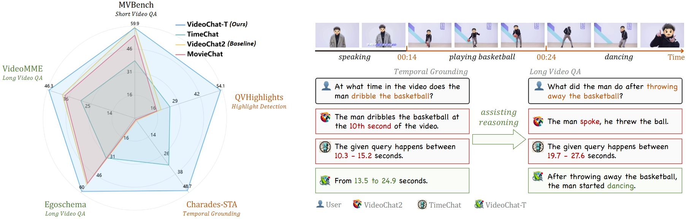
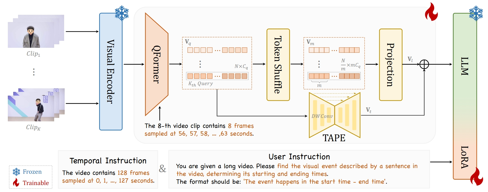

<div align="center">

<h2><a href="">TimeSuite: Improving MLLMs for Long Video Understanding via Grounded Tuning</a></h2>

[Xiangyu Zeng](https://scholar.google.com/citations?user=jS13DXkAAAAJ&hl=zh-CN), [Kunchang Li](https://scholar.google.com/citations?user=D4tLSbsAAAAJ), Chenting Wang, [Xinhao Li](https://scholar.google.com/citations?user=evR3uR0AAAAJ&hl=zh-CN), Tianxiang Jiang, Ziang Yan, Songze Li, Yansong Shi, Zhengrong Yue, [Yi Wang](https://scholar.google.com.hk/citations?hl=zh-CN&user=Xm2M8UwAAAAJ), [Yali Wang](https://scholar.google.com/citations?user=hD948dkAAAAJ), [Yu Qiao](https://scholar.google.com/citations?user=gFtI-8QAAAAJ&hl), and [Limin Wang](https://scholar.google.com/citations?user=HEuN8PcAAAAJ)

</div>


## :parrot: Introduction

This paper proposes TimeSuite, a collection of new designs to adapt the existing short-form video MLLMs for long video understanding, including a simple yet efficient framework to process long video sequence, a high-quality video dataset for grounded tuning of MLLMs, and a carefully-designed instruction tuning task to explicitly incorporate the grounding supervision in the traditional QA format.

**State-of-the-art performance**: VideoChat-T demonstrates high performance for both long-form video question answering and temporal grounding.



**Highly efficient model architecture** with exceptional inference speed, encoding each video frame into just **3 tokens**, leading to the flops of our VideoChat-T are 5.1% of Llava-OneVision




## :fire: Updates

TODO


## Inference & Demo

TODO


## Evaluation Results


We modify lmms-eval to eval ..

## Short-to Long Training


### [Instruction Data](./DATA.md)

We build a diver instruction data with **2M** samples from 34 distince sources. Check [DATA](./DATA.md) for more details.

### Model

| Stage | Num. frames | ViT | Connector | LLM | Shell |
|--------|:-------:|:------:|:------:|:------:|:------:|
| Stage-1 | 4 | :snowflake: | :fire: | :snowflake: | TBD |
| Stage-2 | 4-8 | :fire: | :fire: | :fire: | TBD |
| Stage-3 | 64-512 | :fire: | :fire: | :fire: | TBD |
| Stage-4 | 64-512 | :fire: | :fire: | :snowflake: | TBD |


## :bar_chart: [Multi-Hop NIAH](./BENCHMARK.md)


# :page_facing_up: Citation

If you find this project useful in your research, please consider cite:
```BibTeX

```

# :dizzy: Acknowledgement

<!-- Thanks to the open source of the following projects:

[InternVideo](https://github.com/OpenGVLab/InternVideo), [UMT](https://github.com/OpenGVLab/unmasked_teacher), [Qwen](https://github.com/Vision-CAIR/MiniGPT-4), [LLaVA-VL](https://github.com/Vision-CAIR/MiniGPT-4) -->
