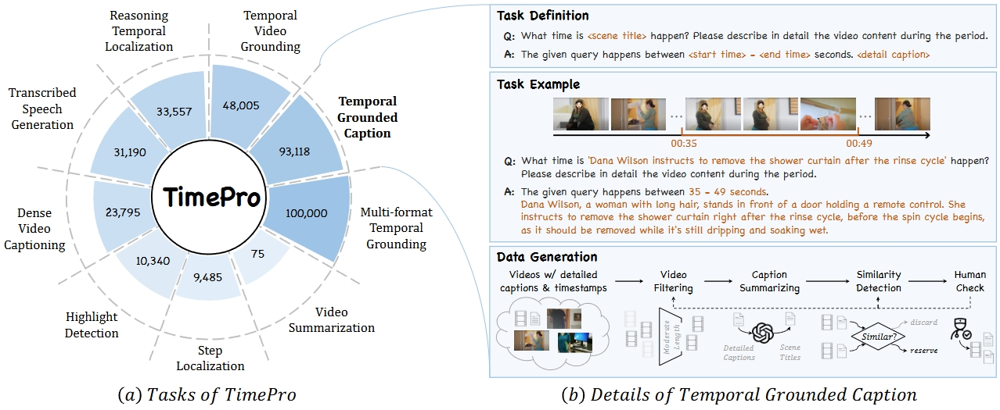

<div align="center">

<h2><a href="https://arxiv.org/abs/2410.19702">[ICLR 2025] TimeSuite: Improving MLLMs for Long Video Understanding via Grounded Tuning</a></h2>

[Xiangyu Zeng](https://scholar.google.com/citations?user=jS13DXkAAAAJ&hl=zh-CN), [Kunchang Li](https://scholar.google.com/citations?user=D4tLSbsAAAAJ), [Chenting Wang](https://scholar.google.com/citations?user=f81ulHQAAAAJ&hl=zh-CN), [Xinhao Li](https://scholar.google.com/citations?user=evR3uR0AAAAJ&hl=zh-CN), Tianxiang Jiang, [Ziang Yan](https://scholar.google.com/citations?user=78lx13MAAAAJ&hl=zh-CN), [Songze Li](https://scholar.google.com/citations?user=8rBMUD4AAAAJ&hl=zh-CN), Yansong Shi, Zhengrong Yue, [Yi Wang](https://scholar.google.com.hk/citations?hl=zh-CN&user=Xm2M8UwAAAAJ), [Yali Wang](https://scholar.google.com/citations?user=hD948dkAAAAJ), [Yu Qiao](https://scholar.google.com/citations?user=gFtI-8QAAAAJ&hl), and [Limin Wang](https://scholar.google.com/citations?user=HEuN8PcAAAAJ)

</div>

## :parrot: Introduction

This paper proposes TimeSuite, a collection of new designs to adapt the existing short-form video MLLMs for long video understanding, including a simple yet efficient framework to process long video sequence, a high-quality video dataset for grounded tuning of MLLMs, and a carefully-designed instruction tuning task to explicitly incorporate the grounding supervision in the traditional QA format.

**State-of-the-art performance**: VideoChat-T demonstrates high performance for both long-form video question answering and temporal grounding.


**Highly efficient model architecture** with exceptional inference speed, encoding each video frame into just **3 tokens**, leading to the flops of our VideoChat-T are 5.1% of Llava-OneVision


**High-quality data**
- We introduced the comprehensive dataset TimePro, which includes 9 task types with video sources from 15 different datasets.
- We designed a novel Temporal Grounded Caption fine-tuning task to effectively mitigate hallucinations in MLLM.


## :fire: Updates

- 2025.02.12 TimeSuite is now initially open-sourced. We welcome everyone to try it out!
- 2025.01.23 TimeSuite has been accepted by ICLR 2025.
- 2024.10.25 The paper of TimeSuite has been uploaded to arXiv.

## Preparation

- Create a new environment and run the command to install the necessary dependencies.

```
conda create --name TimeSuite
conda activate TimeSuite
pip install -r requirements.txt
```

- Download the model and code of TimeSuite from [https://huggingface.co/Lanxingxuan/TimeSuite](https://huggingface.co/Lanxingxuan/TimeSuite) to the `./download` folder. (Please note that you need to additionally download [Mistral-7B-Instruct-v0.2](https://huggingface.co/mistralai/Mistral-7B-Instruct-v0.2) to `./download/parameters`)

- Search for all instances of `/path_to_the_timesuite_root_folder` and replace them with the directory of the TimeSuite root folder.

- Please search for all video dataset paths containing `s3://` and replace them with the corresponding video dataset paths on your server.

## Inference & Demo

- Run `demo/demo.ipynb` to see the demo provided in the paper, or try out the videos and questions of your choice.

- Run `eval/eval_qa_tasks.ipynb` to test the general QA performance of the model.

- To test the temporal grounding capability of TimeSuite, please follow these two steps.

```
bash eval/test_grounding.sh
bash eval/get_grounding_result.sh
```

## Grounded Training


TODO


# :page_facing_up: Citation

If you find this project useful in your research, please consider cite:
```BibTeX
@article{zeng2024timesuite,
  title={Timesuite: Improving mllms for long video understanding via grounded tuning},
  author={Zeng, Xiangyu and Li, Kunchang and Wang, Chenting and Li, Xinhao and Jiang, Tianxiang and Yan, Ziang and Li, Songze and Shi, Yansong and Yue, Zhengrong and Wang, Yi and others},
  journal={arXiv preprint arXiv:2410.19702},
  year={2024}
}
```

# :dizzy: Acknowledgement

<!-- Thanks to the open source of the following projects:

[InternVideo](https://github.com/OpenGVLab/InternVideo), [UMT](https://github.com/OpenGVLab/unmasked_teacher), [Qwen](https://github.com/Vision-CAIR/MiniGPT-4), [LLaVA-VL](https://github.com/Vision-CAIR/MiniGPT-4) -->
